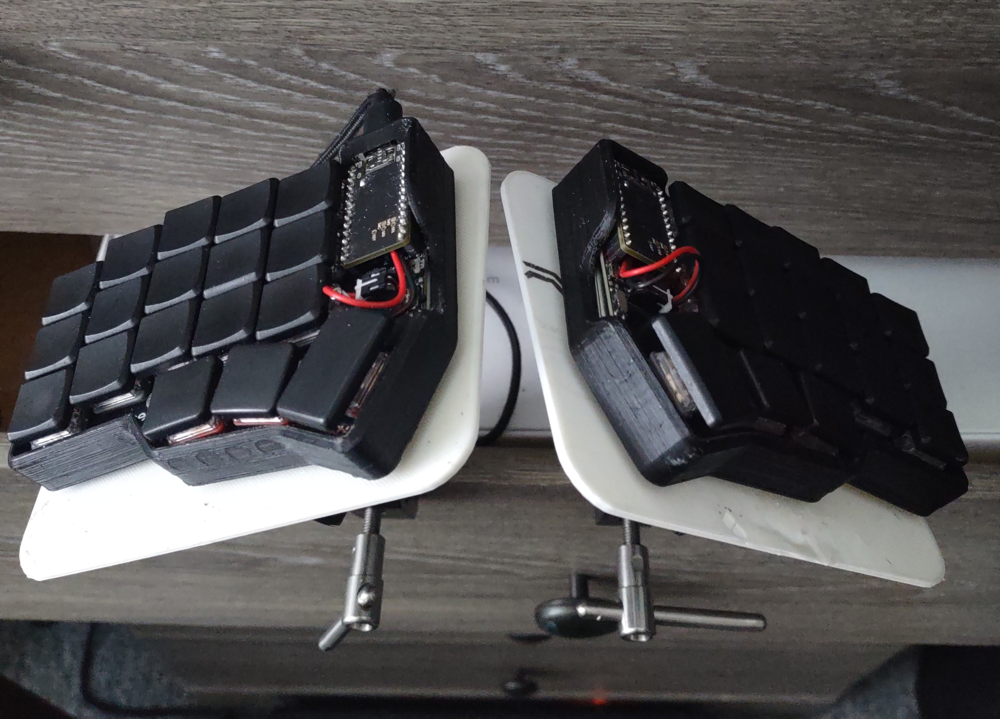
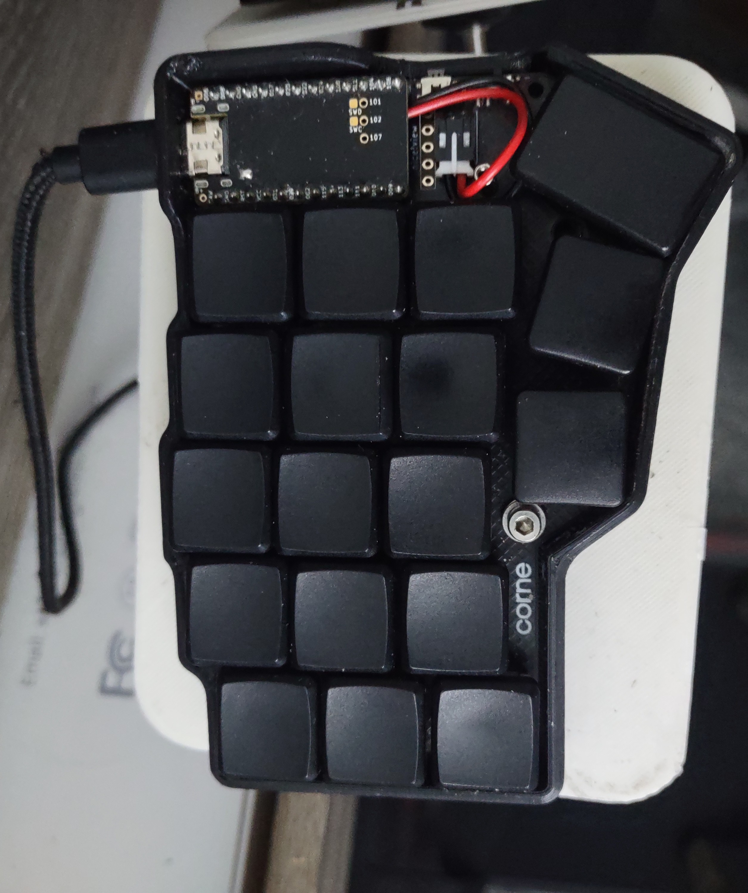
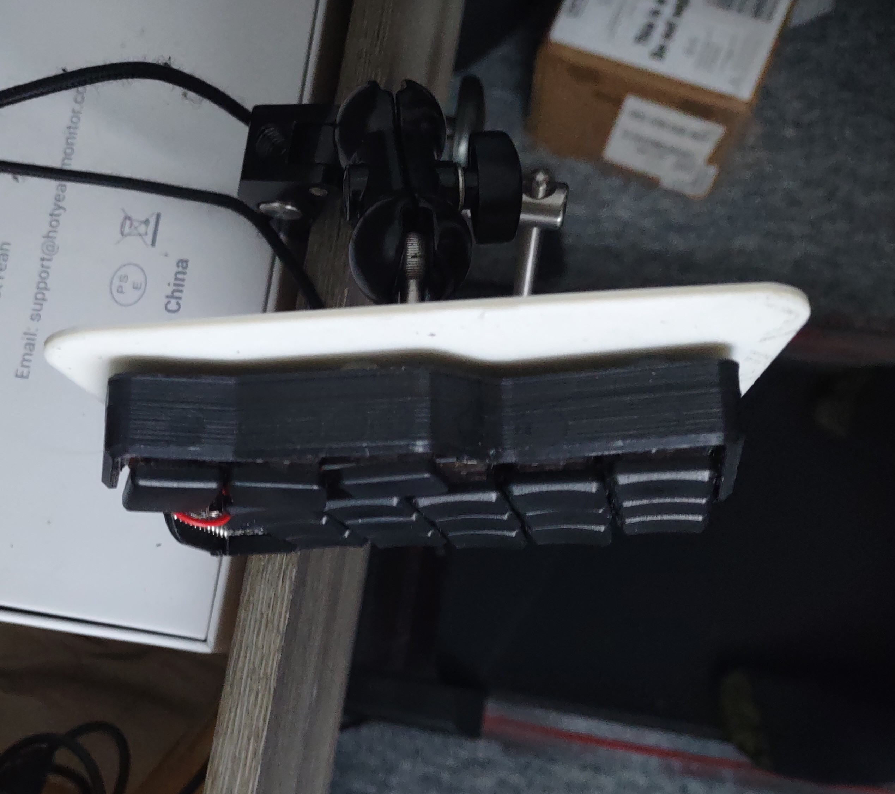

Here is an ergonomic keyboard I made, a Corne

# TODO:

- [x] When I want to press escape after typing something fast (like in neovim) it types "eo" instead
- [x] Home-row mods get in the way of fast typing for me'
- [x] Change moving the mouse and arrow keys so that they are on the right hand only
- [x] Sometimes i press a key 1 times and it presses it 2x, there is a setting for this
