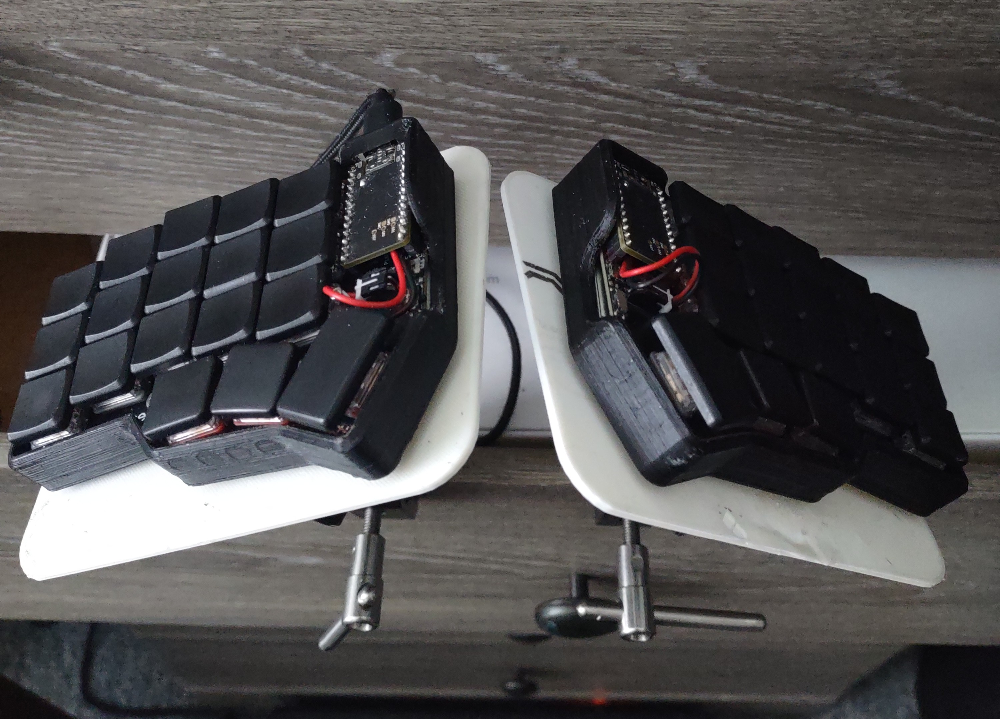
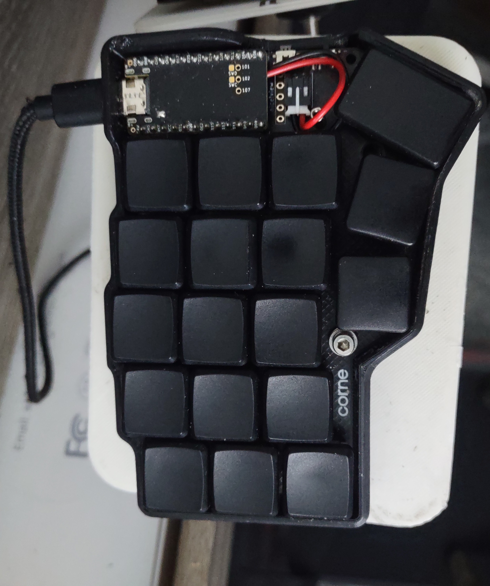
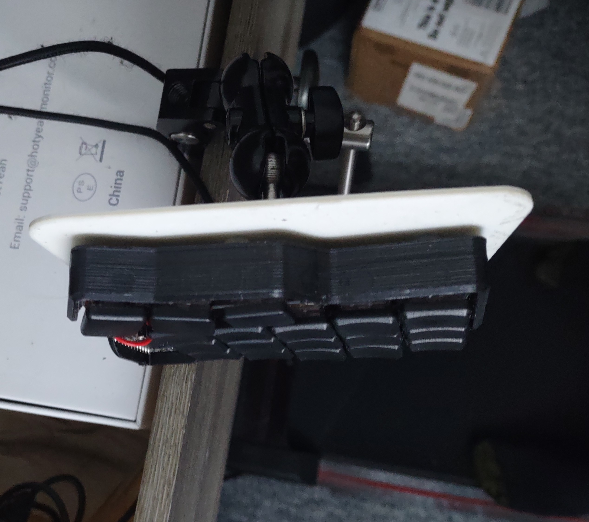

# Keyboards

My ZMK firmware config for all my keyboards. One repo, one keymap philosophy,
multiple boards.

| Keyboard | Keys | Controller | Shield source |
|----------|------|-----------|---------------|
| Corne    | 42 (36 used) | nice!nano v2 | ZMK mainline |
| TOTEM    | 38   | Seeed XIAO BLE | vendored in `config/boards/shields/totem` ([GEIGEIGEIST](https://github.com/GEIGEIGEIST/zmk-config-totem)) |


## Repo layout

```
build.yaml                     # board+shield build matrix (GitHub Actions)
config/
  west.yml                     # ZMK source (urob's mouse-3.2 fork)
  corne.keymap  corne.conf     # per-keyboard keymap + kconfig
  totem.keymap  totem.conf
  boards/shields/<shield>/     # shields not in ZMK mainline, vendored here
.github/workflows/build.yml    # pinned to zmk@v0.1 (compatible with the old fork)
```

Both keymaps are the same layout (3×5+3 with homerow mods, combos for
esc/tab, mouse layers). The TOTEM version is a position-remapped port of
the Corne keymap; its two extra bottom-row pinky keys carry F11/F12 on
the system layer.

## Adding a keyboard

1. If the shield isn't in ZMK mainline, vendor it under
   `config/boards/shields/<shield>/`.
2. Add `config/<shield>.keymap` and `config/<shield>.conf`.
3. Add the board+shield pair(s) to `build.yaml`.
4. Push — GitHub Actions builds the `.uf2` files as artifacts.

## Flashing

1. Download the firmware artifact from the latest Actions run
   (`gh run download --repo MattHandzel/Keyboards`).
2. Put a half into bootloader mode:
   - **nice!nano (Corne):** double-tap the reset button → mounts as `NICENANO`.
   - **XIAO BLE (TOTEM):** double-tap the tiny reset button next to USB-C →
     mounts as `XIAO-SENSE`.
3. Copy the matching `*_left`/`*_right` `.uf2` onto the drive; it flashes and
   reboots itself.

Left halves are the BLE central: the computer pairs with the left side.

## Photos






